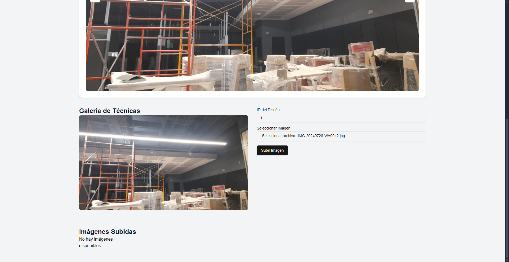
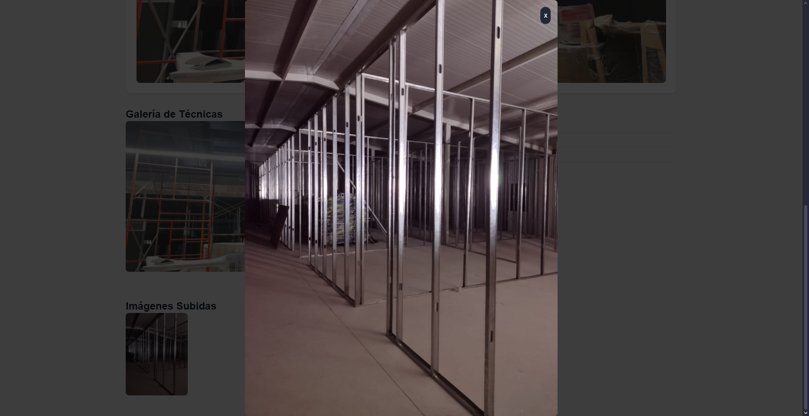
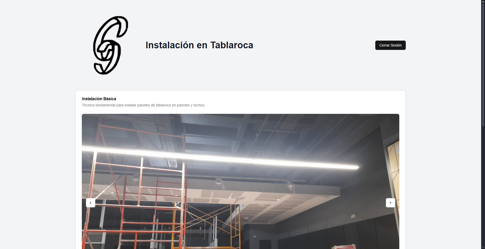
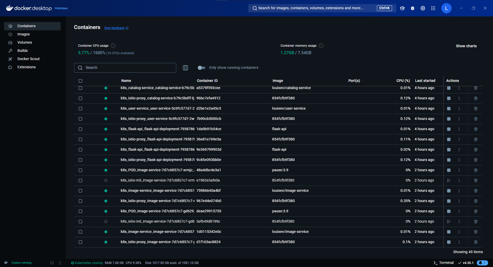
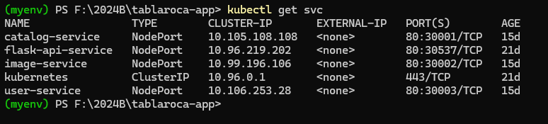
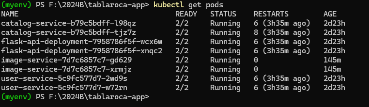
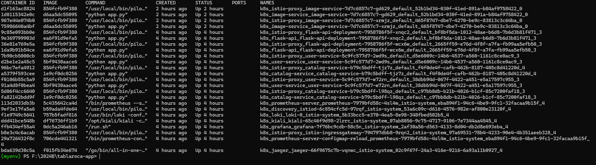
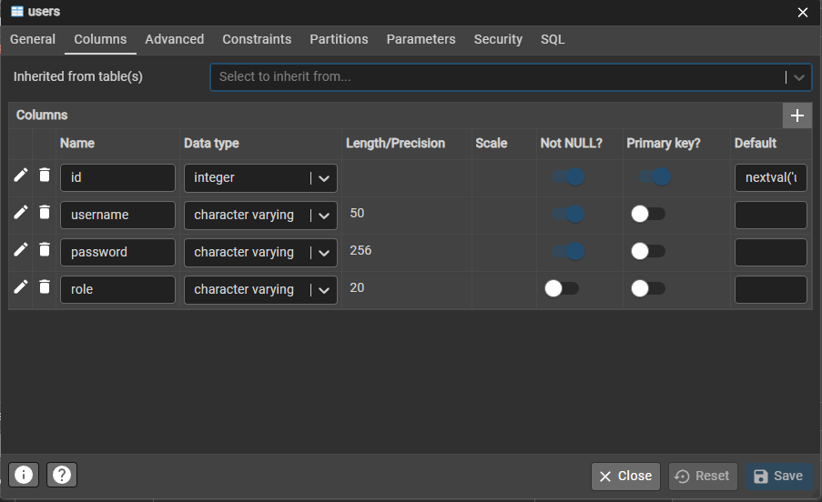
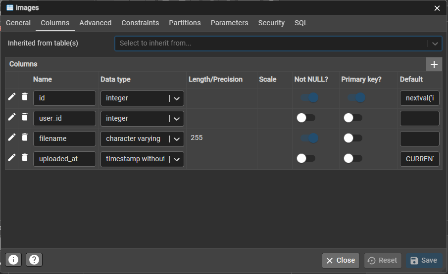
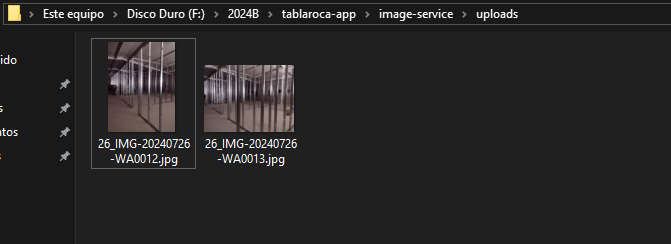

# Aplicación Web para diseños de Tablaroca
 Página web para visualizar diferentes tipos de diseño en tablaroca, así como poder subir tus propias imagenes.

## Interfaz

  Cuenta con servicio de autenticación y registro de usuarios.

## Subida de imágenes

  El usuario también es capaz de subir sus propias imágenes de diseños.

  Y también tiene la opción de visualizarlas mejor.

  Una vez que se cierra sesión, las imagenes subidas no se podran ver hasta que el usuario vuelva a ingresar sus datos de sesión.

## Backend

Los servicios están alojados en contenedores utilizando Docker, y orquestando con Kubernetes.

De momento los servicios que se encuentran funcionando son el servicio de autenticación y registro, y el servicio de imágenes.

### Servicios en Kubernetes

### Pods en Kubernetes

### Todos los contenedores en Docker

## Tabla de autenticación y registro 

  Utilizo una base de datos en PostgreSQL para almacenar el nombre de usuario y la contraseña de los usuarios que se registran, al momento de registrarse, la base de datos guarda el id como PK, el nombre de usuario y la contraseña. La contraseña se guarda en forma de hash utilizando JWT(libreria) para seguridad de la misma.

  

## Tabla para subida de imagenes

  En esta tabla se almacena el id como PK, el usuario que subió dicha imagen, el nombre del archivo ya que se puede elegir que archivo subir desde el frontend y la fecha de la subida.

  

  Las imágenes se guardan localmente en mi computadora y estas son devueltas para ser visualizadas en el frontend.

  
