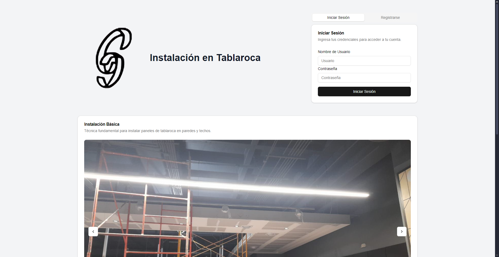
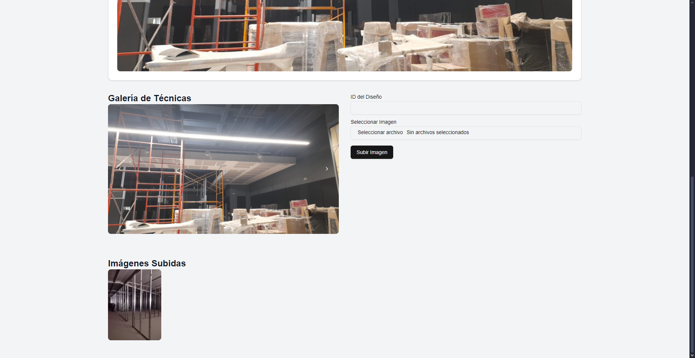

# Aplicación Web para diseños de Tablaroca
 Página web para visualizar diferentes tipos de diseño en tablaroca, así como poder subir tus propias imagenes.

## Interfaz

  Cuenta con servicio de autenticación y registro de usuarios.

## Subida de imágenes

  El usuario también es capaz de subir sus propias imágenes de diseños.

  Y también tiene la opción de visualizarlas mejor.

  Una vez que se cierra sesión, las imagenes subidas no se podran ver hasta que el usuario vuelva a ingresar sus datos de sesión.

  

